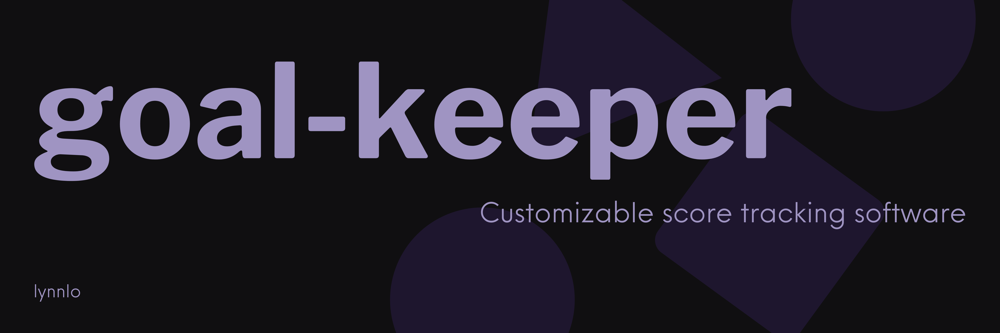

# goal-keeper

Currently in beta, goal-keeper is meant to serve as an simple and sastisfying alternative to existing score keeping methods.

## Running

To run just git clone the folder, install dependencies and run.

```bash
# clone directory
git clone https://github.com/lynnlo/goal-keeper.git

# create a new project in my-app
npx sv create my-app
```
